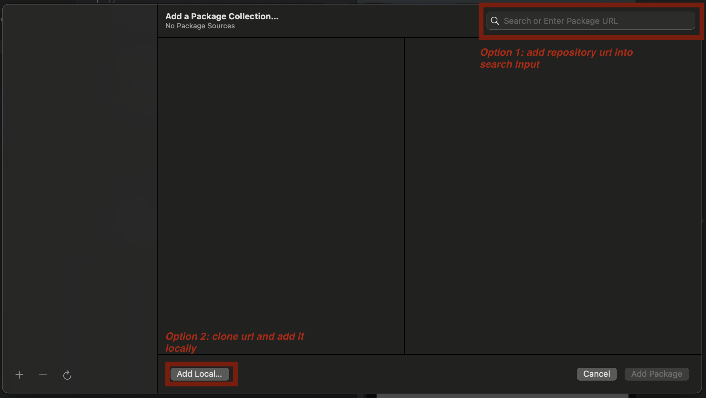
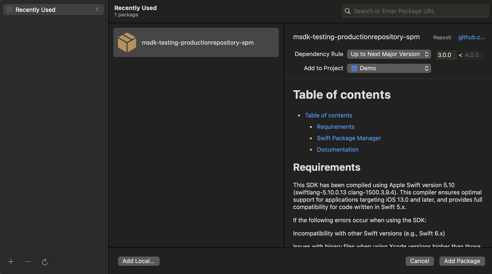
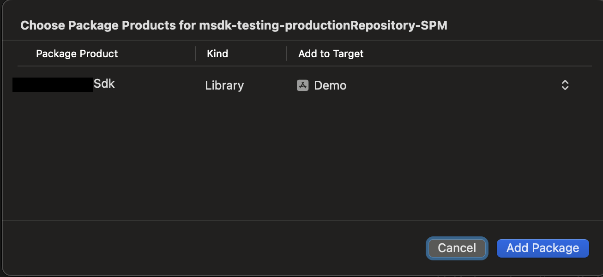
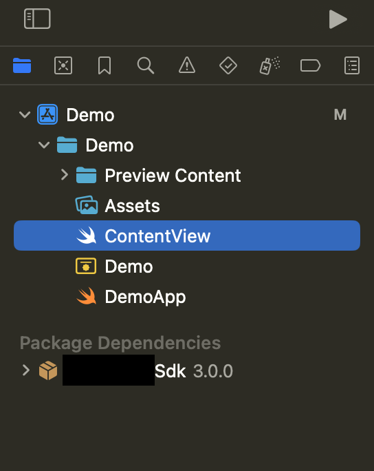

# Table of contents

- [Table of contents](#table-of-contents)
  - [Requirements](#requirements)
  - [SPM Contains](#spm-contains)
  - [How to Add the Package to Your Xcode Project](#how-to-add-the-package-to-your-xcode-project)
  - [Documentation](#documentation)

## Requirements

The `PostFinanceCheckoutSdk` Swift Package requires Xcode 16.2 or later (Swift 6.0.3+), Swift Package Manager 5.9+, and targets iOS 12.4 or later. Since the package includes precompiled binary frameworks (.xcframework), using an older Xcode or incompatible Swift compiler version may result in build or runtime compatibility issues.

## SPM Contains

The Swift Package includes the following precompiled binary frameworks:

- **PostFinanceCheckoutSdk** – core SDK functionality
- **ReactBrownfield** – React Native brownfield integration layer
- **ThreeDS_SDK** – 3-D Secure authentication support
- **TwintSDK** – TWINT payment method integration
- **hermes** – Hermes JavaScript engine runtime used by the React Native layer

All modules are distributed as `.xcframework` binaries and are automatically resolved by Swift Package Manager during integration.

## How to Add the Package to Your Xcode Project

1. Open your project in **Xcode**.
2. Go to the menu bar and select **File** → **Add Package Dependencies...**
3. In the dialog that appears, you can choose between two options:
   - **Option 1**: Let Xcode fetch the package directly from the repository.
     - Enter the repository URL in the search field:  
       `https://github.com/WhiteLabelGithubOwnerName/ios-msdk-spm-postfinance-staging`
   - **Option 2**: Clone the repository manually and add it as a **local package**.

   

4. After selecting the package, click **Add Package**.  
   

5. Choose the appropriate target for the package and press **Add Package**.  
   

6. The new package will now be added to your project.  
   

## Documentation

- [API Reference](./docs/api-reference.md)
- [Integration](./docs/integration.md)
- [Theming](./docs/theming.md)
- [Apple Pay](./docs/apple-pay.md)
- [Troubleshooting](./docs/troubleshooting.md)
